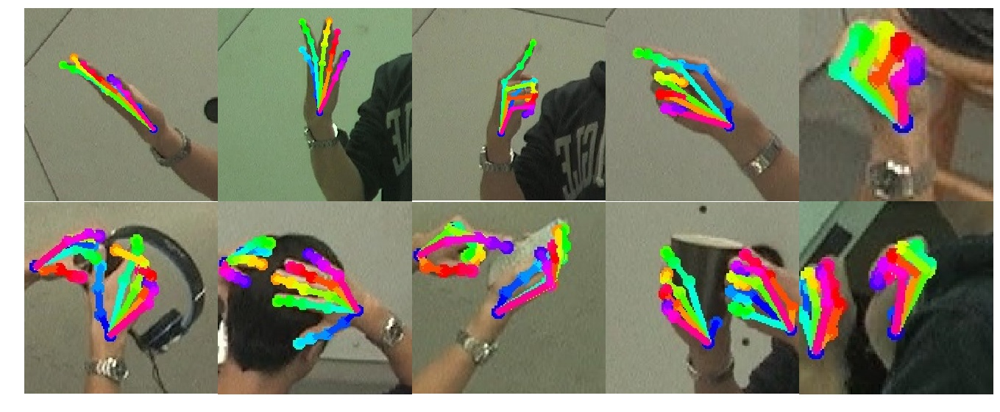
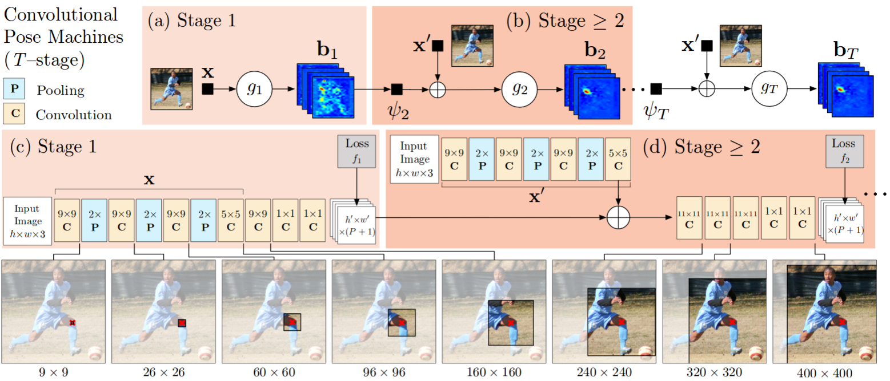
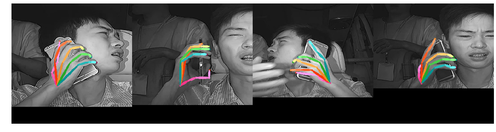

# Hand Pose Estimation
zikui cai @ streamax as a computer vision intern from June 25,2018 - August 24,2018

This repo contains 2 projects, keras version of [**Realtime Multi-Person 2D Pose Estimation using Part Affinity Fields**](https://arxiv.org/abs/1611.08050) (openpose) and tensorflow version of [**Convolutional Pose Machines**](https://arxiv.org/abs/1602.00134) (cpm).

## [Openpose](https://github.com/CMU-Perceptual-Computing-Lab/openpose)
I accelerated the test inference of the model in [**anatolix/keras_Realtime_Multi-Person_Pose_Estimation**](https://github.com/anatolix/keras_Realtime_Multi-Person_Pose_Estimation) by putting the gaussian filtering operation in the model and also built c++ library for post processing, as shown in [**ildoonet/tf-pose-estimation**](https://github.com/ildoonet/tf-pose-estimation).

### Method Overview
This architecture has 2 branches, the first branch predicts confidence maps, the second branch predicts PAFs. Confidence maps captures the location of each keypoint and PAFs associate the keypoints.


### Testing
You can run the model on 3 modes, image, video and webcam.
```bash
streamax@streamax:~/handpose-streamax/openpose$ python demo_image.py
```

I just made several lines of modifications to the [get_testing_model](https://github.com/anatolix/keras_Realtime_Multi-Person_Pose_Estimation/blob/new-generation/model.py) code to shorten the post-processing time, the basic idea is to run the gaussian filtering operation on GPU.

```python
### resize the input image
img_resized = Lambda(lambda image: tf.image.resize_bicubic(image, (boxsize,boxsize), align_corners=True))(img_input)

... some code in between ...

### resize methods: better result, bilinear is faster(<0.05s) but bicubic is smoother(>0.06s)
heat_up = Lambda(lambda image: tf.image.resize_bicubic(image, (height,width), align_corners=True, name='upsample_heatmat'))(stageT_branch2_out)
paf_up = Lambda(lambda image: tf.image.resize_bicubic(image,  (height,width), align_corners=True, name='upsample_pafmat'))(stageT_branch1_out)

### gaussian blur: 
kern2d = get_kern2d(25,3.0,np_branch2)
gaussian_heat = Lambda(lambda image: tf.nn.depthwise_conv2d(image, kern2d, [1, 1, 1, 1], padding='SAME'))(heat_up)

### find peaks:
max_pooled_heat = MaxPooling2D(pool_size=(3,3), strides=(1,1), padding='same', data_format='channels_last')(gaussian_heat)
choose_mat = Lambda(lambda blur: tf.equal(blur, max_pooled_heat))(gaussian_heat)
zeros_heat = Lambda(lambda zeros: tf.zeros_like(zeros))(gaussian_heat)
peaks_heat = Lambda(lambda blur: tf.where(choose_mat, blur, zeros_heat))(gaussian_heat)
```

Then we can use c++ library [pafprocess](https://github.com/ildoonet/tf-pose-estimation/tree/master/tf_pose/pafprocess) to fast associate the peaks in heatmaps. 
We need the following 5 files, then [swig](http://www.swig.org/) can generate the pafprocess.py automatically.

- pafprocess.h
- pafprocess.cpp
- pafprocess.i
- numpy.i
- setup.py

the only changes I made are:

 
```c
// pafprocess.h
const int NUM_PART = 21;
const int COCOPAIRS_SIZE = 20;
const int COCOPAIRS_NET[COCOPAIRS_SIZE][2] = {
    {0, 1}, {2, 3}, {4, 5}, {6, 7}, {8, 9}, {10, 11},{12, 13}, {14, 15}, {16, 17}, {18, 19}, 
    {20, 21}, {22, 23}, {24, 25}, {26, 27}, {28, 29}, {30, 31}, {32, 33}, {34, 35}, {36, 37}, {38,39}
};
const int COCOPAIRS[COCOPAIRS_SIZE][2] = {
    {0,1}, {1,2}, {2,3}, {3,4}, {0,5}, {5,6}, {6,7}, {7,8}, {0,9}, {9,10}, {10,11}, {11,12},
    {0,13}, {13,14}, {14,15}, {15,16}, {0,17}, {17,18}, {18,19}, {19,20}
};

// pafprocess.cpp
// change some numbers accordingly
```

Test speed on [ski.jpg](https://github.com/ZheC/Realtime_Multi-Person_Pose_Estimation/blob/master/testing/sample_image/ski.jpg):

fast version:
```
+++ oriImg shape: (674, 712, 3)
[2018-08-23 19:25:27,512] [KerasPose-image] [INFO] --- predict --- : 0.3539
[2018-08-23 19:25:27,512] [KerasPose-image] [INFO] + get maps time : 0.3557
[2018-08-23 19:25:27,658] [KerasPose-image] [INFO] + associate time: 0.1456
[2018-08-23 19:25:27,676] [KerasPose-image] [INFO] = process time: 0.5197
```

original version:
```
+++ oriImg shape: (674, 712, 3)
[2018-08-23 19:26:06,095] [KerasPose-image] [INFO] --- predict --- : 0.0499
[2018-08-23 19:26:06,182] [KerasPose-image] [INFO] + get maps time : 0.1439
[2018-08-23 19:26:06,820] [KerasPose-image] [INFO] + get peaks time: 0.6380
[2018-08-23 19:26:07,173] [KerasPose-image] [INFO] + associate time: 0.3524
[2018-08-23 19:26:07,187] [KerasPose-image] [INFO] = process time: 1.1493
```

### Training

#### generate h5 file as training dataset
Get the dataset from [cmu panoptic dataset](http://domedb.perception.cs.cmu.edu/handdb.html). We can generate the h5 file using images and annotation data usually in json file, see [hand_h5.py](./openpose/training/hand_h5.py).

The json should at least contain
1. "img_paths" - the corresponding image path
2. "joint_self" - joints and their locations
3. 'objpos' - hand center 
4. 'scale_provided' - the ratio of hand width to boxsize 368, used in data augmentation

json example:

>[{"img_paths": "img_crop/00000000.jpg", "joint_self": [[[111.27, 160.291, 1], [121.745, 150.27, 1], [137.074, 134.816, 1], [148.621, 120.758, 1], [159.89, 110.891, 1], [134.573, 107.807, 1], [143.483, 84.657, 1], [151.064, 69.899, 1], [158.337, 56.815, 1], [126.952, 105.056, 1], [136.035, 79.369, 1], [141.803, 63.323, 1], [147.283, 48.194, 1], [119.158, 106.455, 1], [127.575, 82.715, 1], [133.22, 68.874, 1], [138.842, 55.602, 1], [110.127, 111.249, 1], [113.387, 92.267, 1], [115.21, 81.667, 1], [117.584, 71.46, 1]]], "img_height": 246, "scale_provided": [0.56], "img_width": 247, "objpos": [[123.953, 123.594]]},......]

Refer to [make_dataset.ipynb](./dataset/make_dataset.ipynb) to see how json annotation file is generated.

#### set the path to save the trained weights and training logs
just change the folder name `experiment_name` in [train.py](./openpose/training/train.py), every file generated will be stored in this folder.

#### change hyperparameters to tune the model...
```python
batch_size = 5
base_lr = 2e-5
momentum = 0.9
weight_decay = 5e-4
gamma = 0.333
stepsize = 121746 * 17  # in original code each epoch is 121746 and step change is on 17th epoch
max_iter = 100
```


after 50 training epoches, test the model on testing set:



## [CPM](https://github.com/shihenw/convolutional-pose-machines-release)
This is forked from [**timctho/convolutional-pose-machines-tensorflow**](https://github.com/timctho/convolutional-pose-machines-tensorflow). I used this model to detcet the keypoints of hands. cpm is a simplified version of openpose so this method is faster than openpose; however, it can only detect one hand at a time.

### Method Overview
One branch, detects the keypoints of one object.


### Testing
download weights [**cpm_hand.pkl**](https://drive.google.com/open?id=0Bx1hAYkcBwqnSU9lSm5Ya3B1VTg)




other methods to try: [Cascaded Pyramid Network for Multi-Person Pose Estimation](https://arxiv.org/abs/1711.07319)


# Acknowledgements
These works were done when I was a research intern at **Streamax Technology Co., Ltd** during the summer 2018. I had a great time doing research here! Thank you Streamax!

<a href="http://www.streamax.com/" width="300" height="200" rel="Streamax"></a>